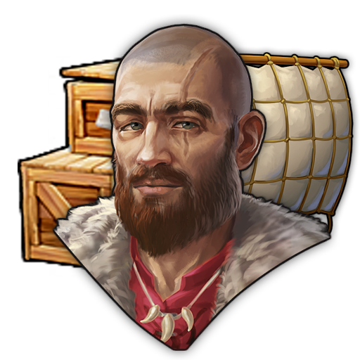

# Captians Specialist Pack - Mod
This mod adds Specialist focused on Ships into Anno 117. This Mod is part as a submod of "Extended Specialists Mod"
***
### Item Overview (AI Generated - Might contain Issues. Please point them out if you find some)
***

***

### Common Rarity Specialists
| Image Preview | GUID | Internal Name | Item name (Title) | Description | Base/Standard Effects |
| :---: | :---: | :---: | :--- | :--- | :--- |
|  | 1600000228 | CaptainArcherRange-C | Ship's archer | It's unclear whether he was trained to aim so well or if he's just drunk. (Captains-Pack) | • +15% Distance Attack Range for Archer Module |

***

### Rare Rarity Specialists
| Image Preview | GUID | Internal Name | Item name (Title) | Description | Base/Standard Effects |
| :---: | :---: | :---: | :--- | :--- | :--- |
|  | 1600000224 | CaptainLessSlots-R | Armored Sailor | Sacrifices storage space for more defense. (Captains-Pack) | • +75% Health |
|  | 1600000029 | CaptainMoreSlots-R | Overloaded Sailor | "We have cargo to ship and aren't sitting geese." (Captains-Pack) | • +1 Item Slots Capacity |

***

### Epic Rarity Specialists
| Image Preview | GUID | Internal Name | Item name (Title) | Description | Base/Standard Effects |
| :---: | :---: | :---: | :--- | :--- | :--- |
|  | 1600000100 | Captain ArchersRange-E | Ocumare, Eagle of the Sea | Swift and with an eagles eye is a force to be reckoned with. (Captains-Pack) | • +10 Speed • +40% Distance Attack Range for Archer Module |
|  | 1600000102 | Captain MoreSlots-E | Ames, Ship Distorter | Arranges armor and goods in such a way that everything appears larger and more formidable. And indeed becomes so. (Captains-Pack) | • +50% Health • +2 Item Slots Capacity |

***

### Legendary Rarity Specialists
| Image Preview | GUID | Internal Name | Item name (Title) | Description | Base/Standard Effects | Boosted Effects | Boost Condition |
| :---: | :---: | :---: | :--- | :--- | :--- | :--- | :--- |
|  | 1600000488 | CaptainMoreSlots-L | Iacobus Garibaldus, Imperial Purveyor | “All roads lead to Rome. And if one of those roads goes through the sea, then I'll take it!” (Captains-Pack) | • +25% Health • +25% Loading Speed • +10% Transfer Speed  • +3 Item Slots Capacity | • +50% Health • +100% Loading Speed  • +25% Transfer Speed • +3 Item Slots Capacity | Requires 24 Trade Routes established. |
|  | 1600000491 | CaptainLessSlots-L | Virodanna Cautia, Overcautious Captain | “Do we really have everything on board? Don't forget the fourth spare sail!” (Captains-Pack) | • +150% Health • +10% Speed • -25% Workforce Maintenance • -3 Item Slots Capacity | • +200% Health • +20% Speed • -75% Workforce Maintenance • -3 Item Slots Capacity | Requires 16 Islands discovered. |
